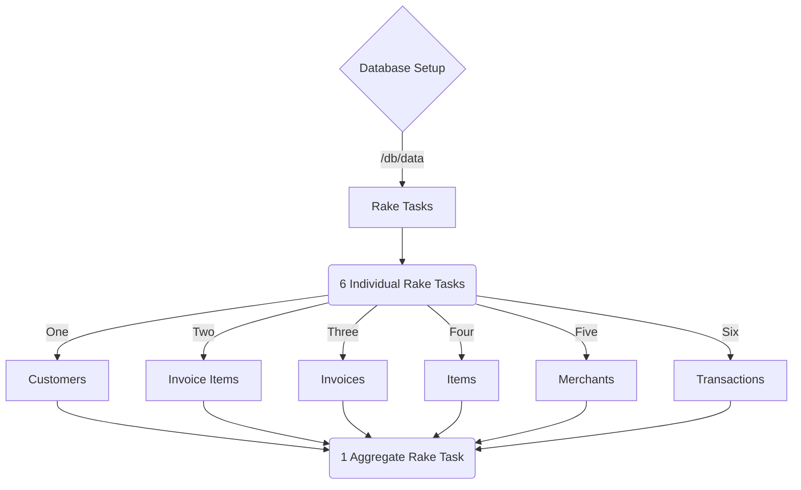

#

## Rake Tasks

# Little Esty Shop

"Little Esty Shop" is a group project that requires students to build a fictitious e-commerce platform where merchants and admins can manage inventory and fulfill customer invoices.

## Learning Goals

- Practice designing a normalized database schema and defining model relationships
- Utilize advanced routing techniques including namespacing to organize and group like functionality together.
- Utilize advanced active record techniques to perform complex database queries
- Practice consuming a public API while utilizing POROs as a way to apply OOP principles to organize code

### contributors

 - [Lisa The Lion Heart](https://github.com/lisataylor5472)
 - [Master Michael ](https://github.com/michaeljhicks)
 - [Samantha The Song Bird](https://github.com/samivari)
 - [Mad Max](https://github.com/MWagner3)

### Self Eval

One February afternoon...
Four Heros set out on a journey together, to battle a creature so rare, she is only found in the ***Land of Turing***, past the battleship grave yard, into a small village named *~*~*~_Mod 2 Backend_~*~*~*.

Within a fortnight our heros,
- Used ActiveRecord in a clear and effective way to read/write data by using the power of grouping, aggregating, and joining.
- Demonstrated the principles of MVC to effectively organize code
- Created 100% coverage for features and models.
- Used partials to dry up repeated view logic.
- Created routes and actions that follow RESTful conventions.
and
- And the true meaning of friendship

And after taking some sad paths and some happy paths; Lisa, Michael, Sam, and Max came out one step closer to *Promotion to Mod 3*
The End.

## Deployment

https://glacial-retreat-77890.herokuapp.com/

## License

This project is licensed under the TuringSchool License and your mom (Lisa if you see this, take out the your mom part)

## Acknowledgments

*This was a lovely group to work with on such a heavy project <3
